## 📊 Problem Statement

Predict if a person is diabetic based on:
- Pregnancies
- Glucose
- Blood Pressure
- BMI
- Age

---


# 🩺 Diabetes Prediction Model – MLOPS (FastAPI + Docker + K8s)

This project helps you learn **Building and Deploying an ML Model** using a simple and real-world use case: predicting whether a person is diabetic based on health metrics. We’ll go from:

- ✅ Model Training
- ✅ Building the Model locally
- ✅ API Deployment with FastAPI
- ✅ Dockerization
- ✅ Kubernetes Deployment


We use a Random Forest Classifier trained on the **Pima Indians Diabetes Dataset**.


---

## 🩺 Diabetes Prediction Model – End-to-End MLOps
This project demonstrates a professional MLOps Lifecycle for building, deploying, and monitoring a machine learning model. It covers everything from experimental tracking and data versioning to containerized orchestration and real-time observability.

🚀 Project Milestones :

- ✅ **Model Experimentation:** Tracking runs and parameters.

- ✅ **Data Versioning:** Managing datasets without bloating Git.

- ✅ **API Development:** High-performance serving with FastAPI.

- ✅ **Containerization:** Standardizing environments with Docker.

- ✅ **Orchestration:** Scalable deployment using Kubernetes (Helm).

- ✅ **Production Deployment:** Live cloud hosting using Railway.

- ✅ **Observability:** Real-time monitoring and alerting for model drift.

**🛠 Tech Stack** :

- Machine Learning & MLOps
- **Python:** Core programming language.

- **Scikit-Learn:** Model training and preprocessing.

- **DagsHub (MLflow):** Remote experiment tracking, model registry, and UI for performance comparison.

- **DVC (Data Version Control):** Managing large datasets and model weights with Git-like versioning.

- **Deployment & Infrastructure**
- **FastAPI:** Modern, fast (high-performance) web framework for building the prediction API.

- **Docker:** Packaging the application and its dependencies into a single container image.

- **Kubernetes (K8s):** Orchestrating containers for high availability and scalability.

- **Helm:** Managing Kubernetes applications through reproducible charts.

- **Monitoring & Observability**
- **Prometheus:** Scraping and storing real-time metrics (latency, request rates, prediction distributions).

- **Grafana:** Visualizing system health and model performance dashboards.

- **Developer Productivity**
- **GitHub Co-Pilot:** AI-assisted pair programming for rapid development and debugging.

- **Git/GitHub:** Version control and collaboration.

- **📊 Monitoring Dashboard**
- The project includes a pre-configured Grafana dashboard to track:

- **Prediction Drift:** Monitoring the ratio of diabetic vs. non-diabetic predictions.

- **System Performance:** P95 Inference Latency and API Request/Error rates.

- **Model Health:** Real-time distribution of input features (e.g., Glucose levels).


---

## 🚀 Quick Start

### 1. Clone the Repo

```bash

cd first-mlops-project
```

### 2. Create Virtual Environment

```
python3 -m venv .mlops
source .mlops/bin/activate
```

### 3. Install Dependencies

```
pip install -r requirements.txt
```

## Train the Model

```
python train.py
```

## Run the API Locally

```
uvicorn main:app --reload
```

### Sample Input for /predict

```
{
  "Pregnancies": 2,
  "Glucose": 130,
  "BloodPressure": 70,
  "BMI": 28.5,
  "Age": 45
}
```

## Dockerize the API

### Build the Docker Image

```
docker build -t diabetes-prediction-model .
```

### Run the Container

```
docker run -p 8000:8000 diabetes-prediction-model
```

## Deploy to Kubernetes

```
kubectl apply -f diabetes-prediction-model-deployment.yaml
```


# 📸 Project Screenshots

---


## 🧠 API Documentation (FastAPI)

- ✅ **LOCALHOST**

<p align="center">
  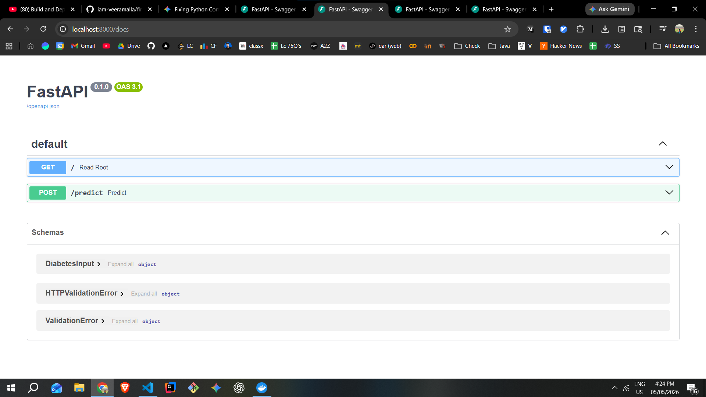
</p>


- ✅ **CONTAINER**

<p align="center">
  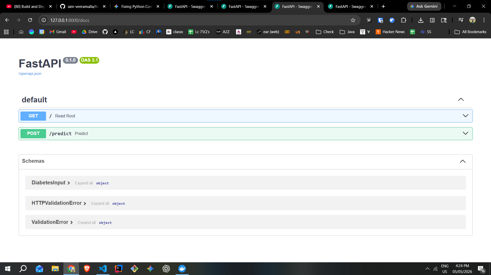
</p>

- ✅ **K8s deployment**

<p align="center">
  
</p>


### 🔍 Prediction Endpoint

<p align="center">
  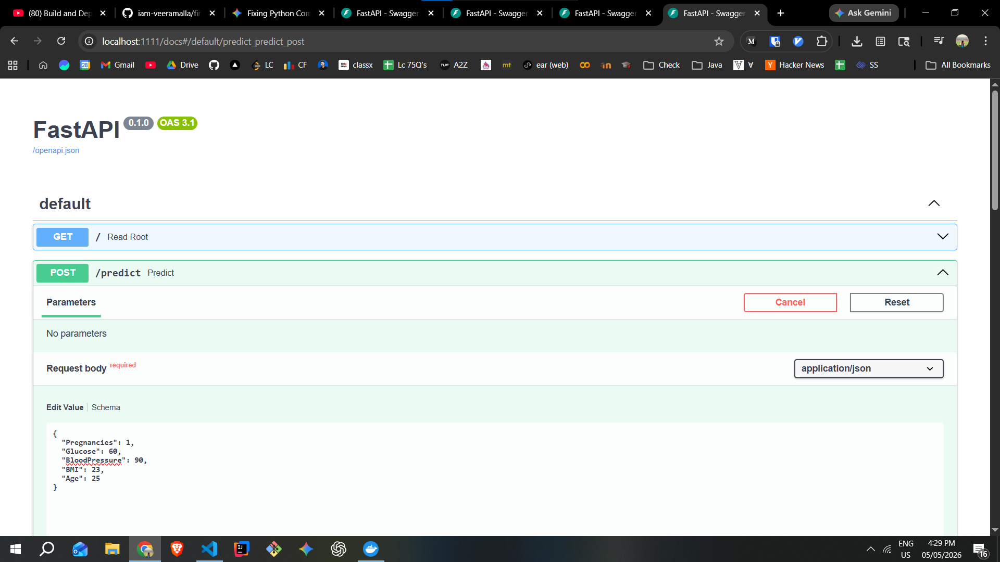
  <br><br>
  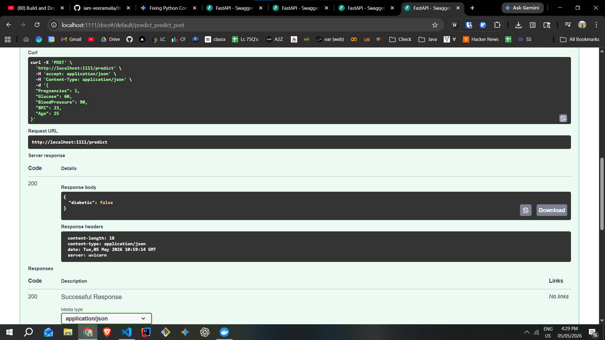
</p>

---

## CI / CD (CO-PILOT)

<p align="center">
  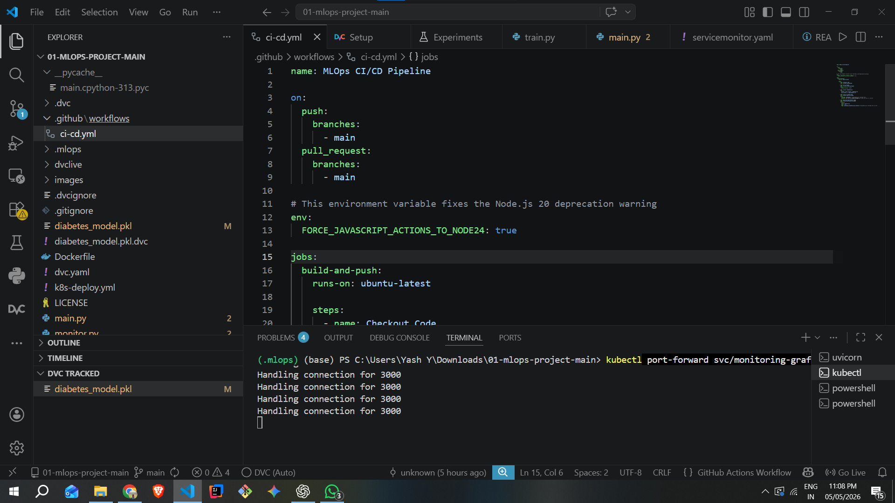
  <br><br>
  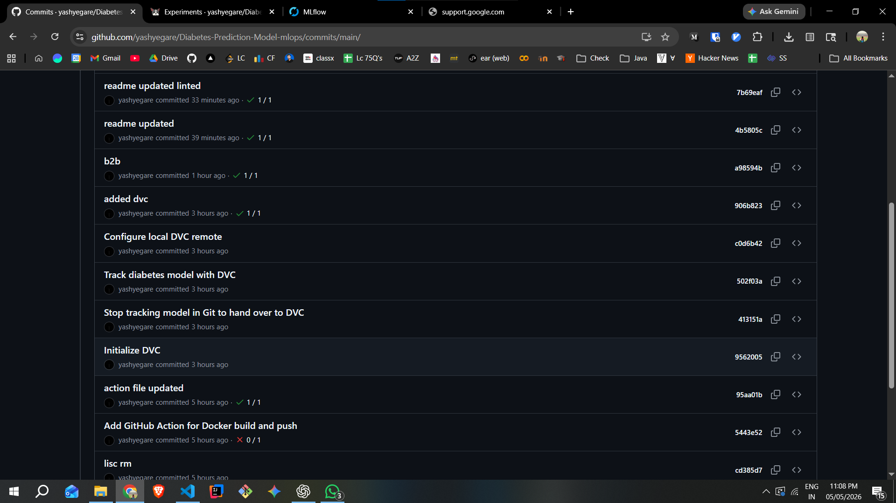
</p>


## 📊 Experiment Tracking (MLflow + DagsHub)

<p align="center">
  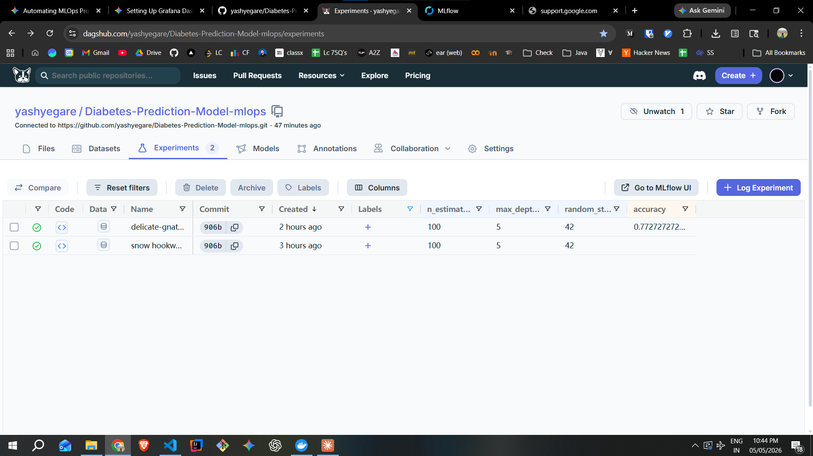
  <br><br>
  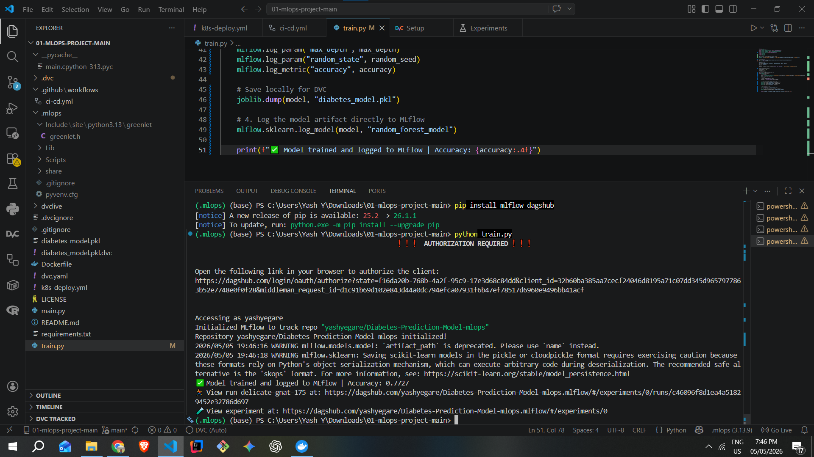
  <br><br>
  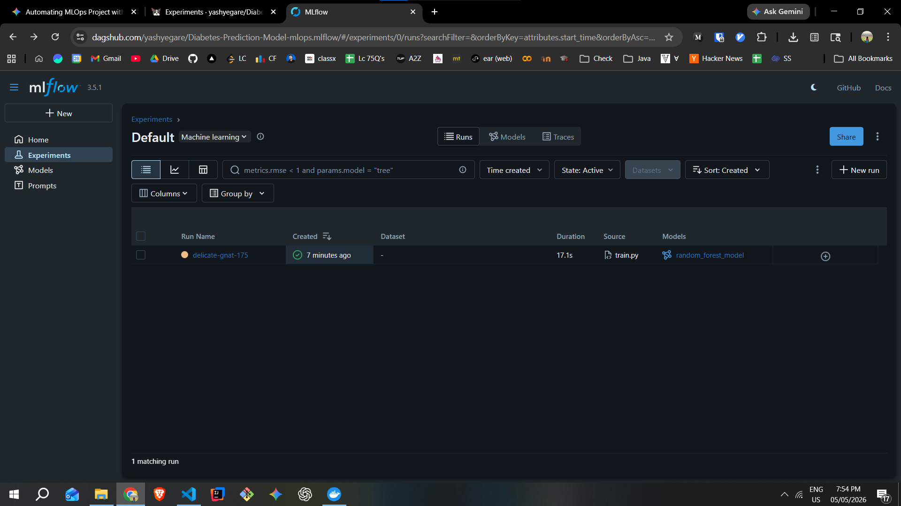
  <br><br>
  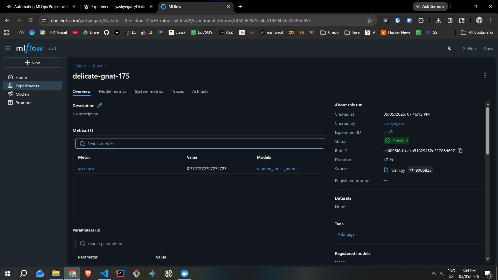
</p>

---

## 📦 Data Versioning (DVC)

<p align="center">
  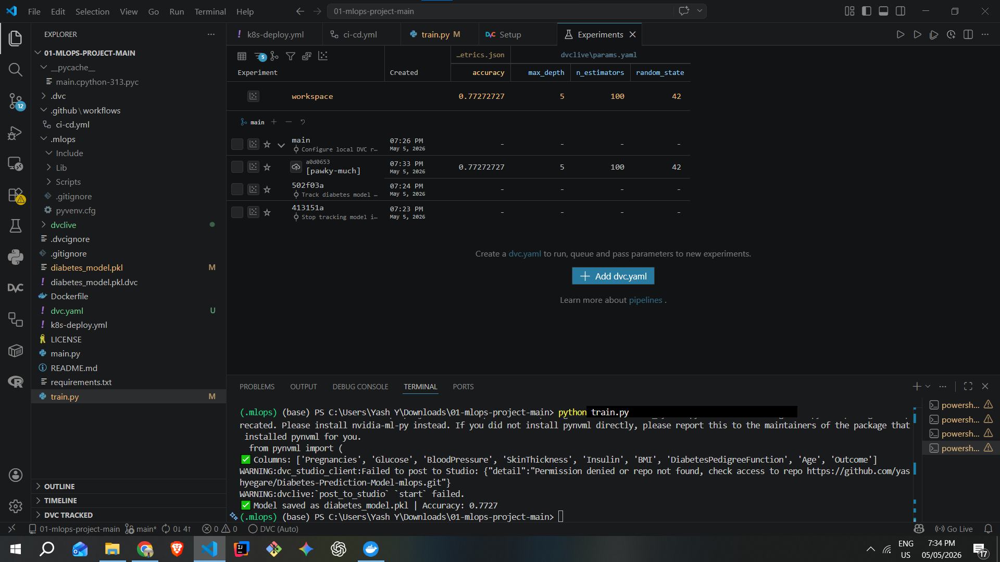
  <br><br>
  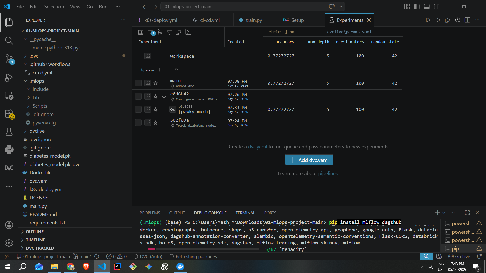
</p>

---

## 🐳 Docker Containerization

<p align="center">
  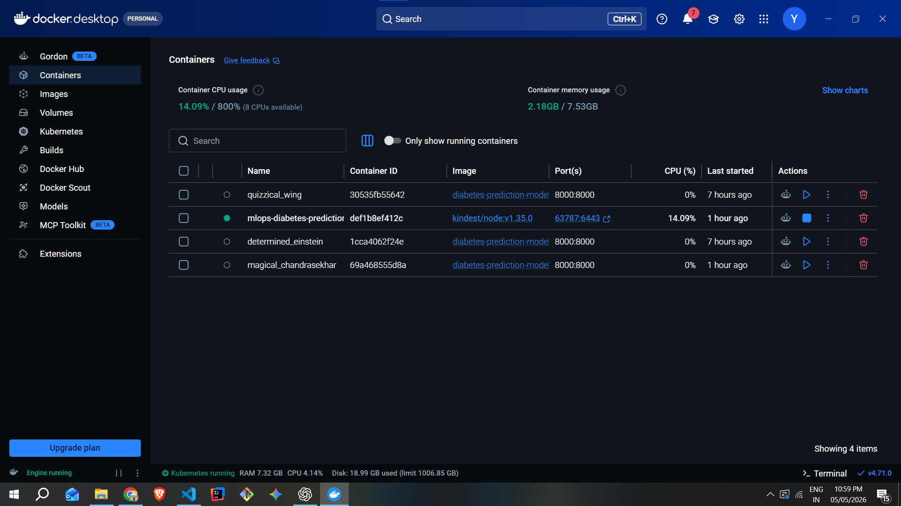
</p>

---

## ☸️ Kubernetes Deployment

<p align="center">
  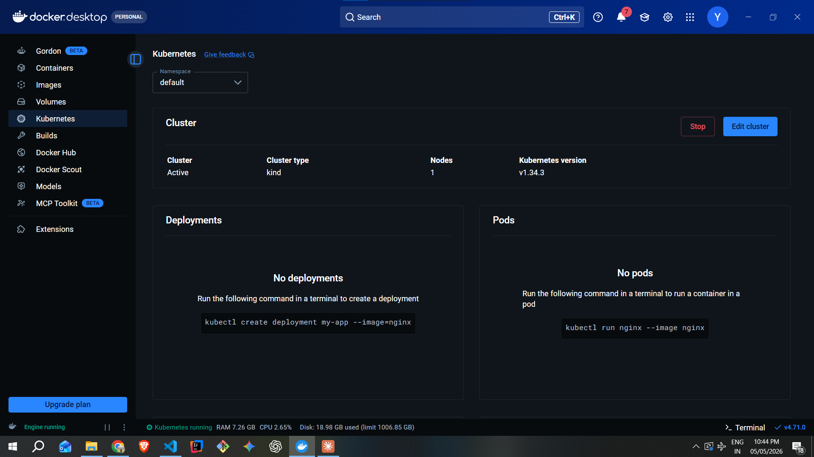
  <br><br>
  
</p>

---

## 📈 Monitoring (Prometheus + Grafana)

<p align="center">
  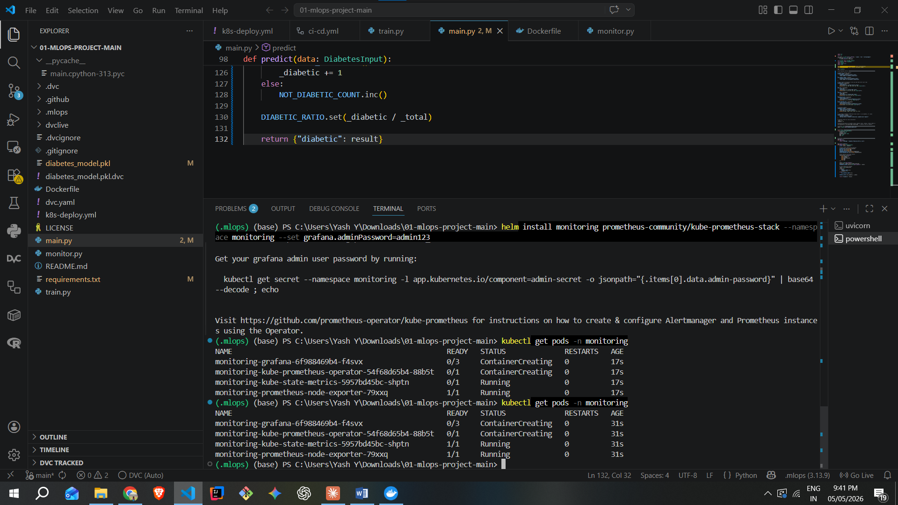
</p>

---

## ☁️ Production Deployment (Railway)

<p align="center">
  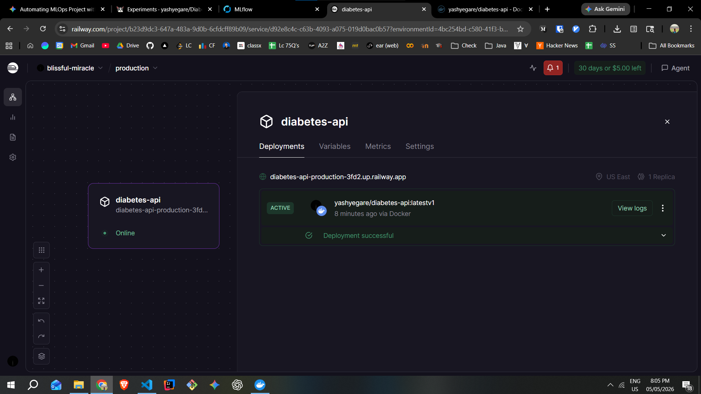
</p>